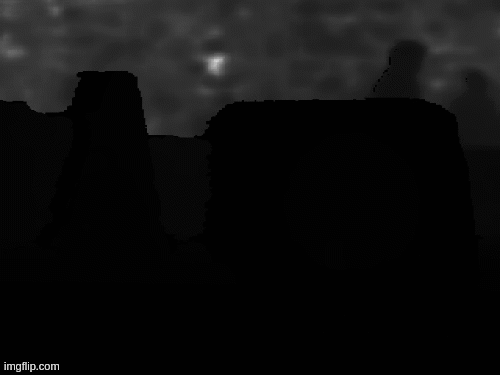
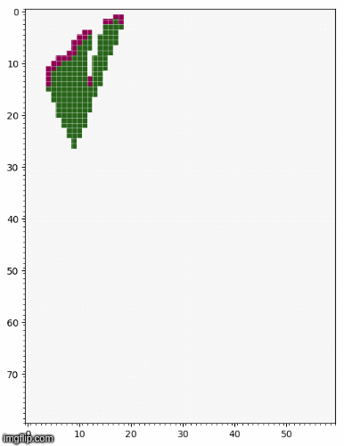
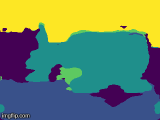
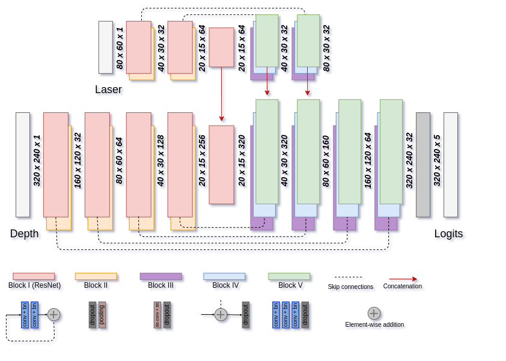

## _salsa_fusion_:

By Harald Lilja

This repository contains an implementation of an encoder-decoder network for semantic scene segmentation based on 2D-LiDAR and depth data. The network design is based on [SalsaNet](https://gitlab.com/aksoyeren/salsanet)

    
    
    

    

